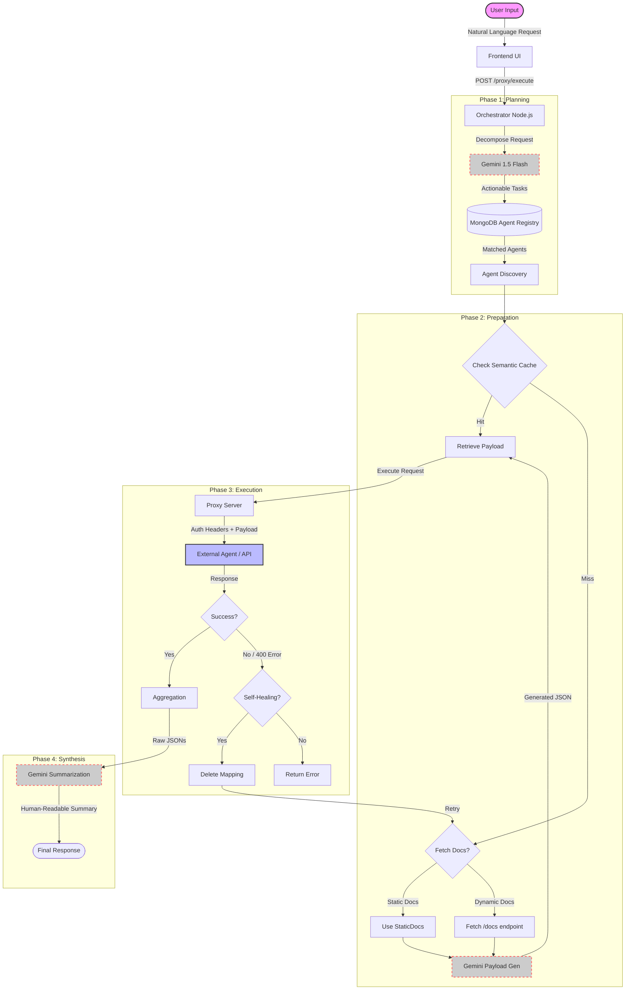

# The Nexus Execution Lifecycle

## Process Flow Diagram

## UI Component Highlights

### Mission Status
- **Visual Progress**: Real-time progress bars and status badges (IDLE, RUNNING, DONE) for each agent task.
- **Location**: Displayed within the "Mission Log" console.

### Log Console
- **Reasoning Log**: A live stream of the AI's thought process, explaining *why* a specific endpoint or parameter was chosen.
- **Transparency**: Shows the raw "Verification Targets" and execution logic.

### Agent Registry
- **Dashboard View**: A list of active, registered agents (e.g., GitHub, SalonBot).
- **Health Status**: Indicators showing if an agent is online and responsive.
